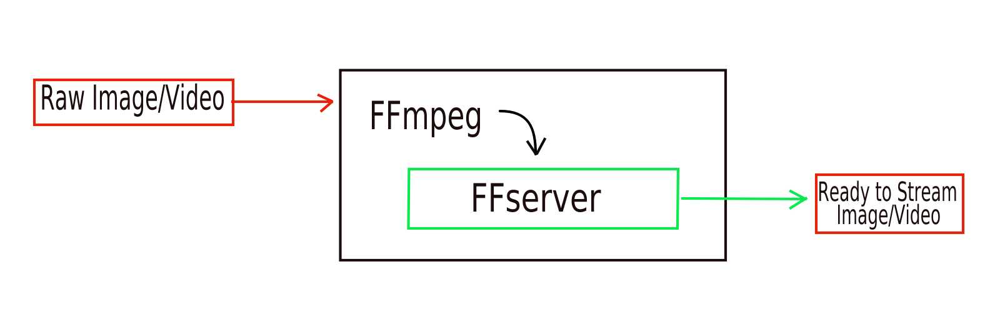

# Adaptative Livestreaming

This project aims to provide a easy configurable way to livestream a video and adapt the stream to the changes in the network.
This means that when the bandwidth available decreases/increases, the quality of the video should follow the same behaviour.

## Architecture

The early version of this project begun with a streaming data from a capture device(Go Pro) to a device that can play the video 
(Smartphone), while avoiding to have a laggy stream.

The video provided by the Go Pro can be directly viewed on the cellphone using the Go Pro App, but the cellphone cannot share 
the video to other devices. This means we need a device to capture the stream and to distribute it to other devices.

To capture the image/video from the Go Pro I used a Raspberry Pi , which is also used to send the data to the Smartphone.

Below is a overview of the devices used and their function:

The Video Stream from the Go Pro is broadcasted via `UDP` in `MPEG-TS` video format, which is not playable by browsers , thus  
we need to transcode the video to another format, supported by browsers. This work is done by `FFmpeg` and `FFserver` which 
provides a simple way to transcode video, while it is still being captured.

In this project, this type of transcoding, produces delays, which continue to grow while video is being captured.

Below is a simple scheme of the process :

## Requirements

In order to use this project you will need : 

* Raspberry Pi v2 B or v3
* Go Pro Hero 4 firmware version 5.0.0
* Smartphone or computer
* USB WIFI Dongle

## Install Guide and Configuration Guide
In order to run this project you will need to install and compile some packages on  the raspberry:

* [Package Install](./dependencies/README.md)
* [Python Dependencies](./dependencies/Python.md)

When you are done with the installs, you can start to configure stuff :

* [Raspberry Configuration](./Rpi_configs/README.md)

## Network Status

This project relies on the adapting the quality of the stream according to the quality of the network. We also need to know 
which devices are in the network, so I made some simple scripts to know that information:
* [Network scripts](./scripts/Network.md)

## Running the project
In order to run this project you will need to start capturing live footage from the Go Pro, then  you should start the 
Adaptative Livestream Script
1. [Go Pro Stream Start Script](./scripts/GoPro.md)
2. [Adaptative Livestream Script](./scripts/Livestream.md)

