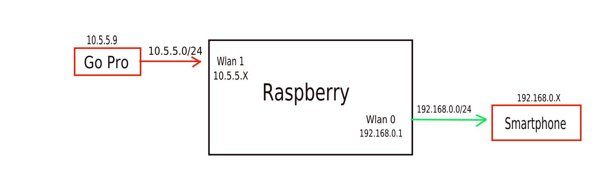

# Configuration

All the files mentioned in this file are available [here](../Rpi_configs/)

## Network configuration
Below it is shown the network architecture of the project:

We will now configure the interface `wlan0` of the Raspberry(which will work as an hotspot):

1. In `/etc/network/interfaces` configured `wlan0` as:  
- Ip: 192.169.0.1 
- Netmask: 255.255.255.0
- Broadcast Address: 192.169.0.255
- Network: 192.169.0.0

2. Configured `wlan0` as an hotspot in `/etc/hostapd/hostapd.conf`

* WPA-PSK
* SSID:Saturday
* Passphrase:video12345

3. Set the path to the hostpad configuration in `/etc/default/hostapd`: 
 - DAEMON_CONF="/etc/hostapd/hostapd.conf"

The interface `wlan1` will not need any special configuration as it will be used to connect to a wifi-network (from the Go 
Pro).

## DHCP Server Configuration

1. Configured the DHCP SERVER to give addresses to the new "machines in the network" in `/etc/dhcpd.conf`

2. Denied interfaces of `wlan0` (built-in Wifi module) in `/etc/dhcpcd.conf`

3. Configured the DHCP SERVER to serve requests on the interface `wlan0` in `/etc/default/isc-dhcp-server`

## FFserver Configuration

We now got to the point, where we need to decide how the stream will look like on the Smartphone. This means we need to 
configure the entities(programs) responsible for the transcoding.

Supposing you have  installed the FFmpeg with all extra packages, you will be able to stream every type of video you want.
Furthermore, you will have the possibility to change the quality of the stream/video and manipulating the output. This means,
that you decide the format of the stream.

We will start to configure the stream:

1. Create a file, where the configuration will be set.
2. Specify the location of the temp file which will hold the "temporary transcoded video".
3. In the file we can configure the address and port where the stream will be streamed, the quality of it, the bandwidth 
available, the max number of clients, video resolution , etc.

There are several examples of configurations in the [`ffserver_configs/`](./ffserver_configs) folder.

I strongly suggest you to use the `mjpg` format or the `webm` format configurations, because these formats are browser 
compatible.

## NGINX Configuration

We need to setup a proxy server act as a intermidiary between FFmpeg and the Smartphone, alllowing the Smartphone to send 
requests and receive responses.

The configuration I used was [this](../Rpi_configs/nginx.conf)
If you look closely you will see that the proxy server is configured to listen in port 80 the only comunicating with the 
cellphone.
There is also a proxy_pass which allows the Smartphone to receive the videostream from FFmpeg.

Whenever the NGNIX Configuration is changed, it is crucial to run `nginx -s reload` on a terminal.

[Main Menu](../README.md)|[Tools ](../scripts/README.md)

